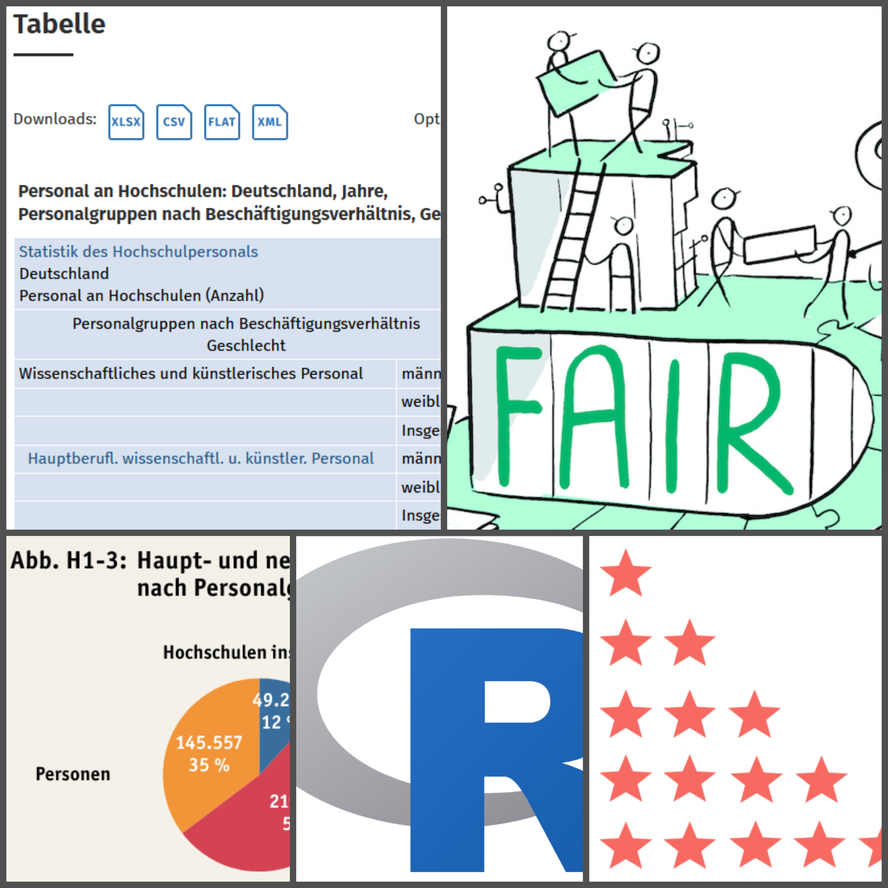

# Reproduzierbarkeit von Datenanalysen: Ein Fallbeispiel aus dem Nationalen Bildungsbericht 
## Entwicklung des Hochschulpersonals in Deutschland 





Diese Fallstudie bildet mit Hilfe eines <a href="https://jupyterbook.org/en/stable/intro.html" target="_blank">JupyterBooks</a> einen Forschungsverlauf in der Verwaltungswissenschaft nach. Dabei wird anhand einer modellhaften Forschungsfrage auf die Reproduzierbarkeit von Analysen und Forschungsergebnissen eingegangen. Dazu werden in einzelnen Kapiteln die Themen Datennachnutzung, Bewertung von Datenqualität und Nachvollziehbarkeit von Analysen behandelt.


## Fokus

Im Fokus stehen dabei Daten des Nationalen Bildungsberichts (2022), anhand derer die Forschungsfrage formuliert wurde: 
**Wie hat sich die Zusammensetzung des Personals an Hochschulen in Deutschland im letzten Jahrzehnt (2010-2020) entwickelt?**
Um diese zu beantworten, vermittelt dieses JupyterBook Kenntnisse in Bezug auf qualitative Bewertungskriterien und Datenmanagement sowie Grundkenntnisse in der Benutzung der statistischen Software R. Diese werden dazu eingesetzt, die Reproduzierbarkeit von datenbasierten Ergebnissen zu prüfen, um schließlich mit einer eigenen Abfrage die Forschungsfrage zu lösen.


## Bedeutung des JupyterBooks für die Verwaltungswissenschaft

Neben der bereits elementaren Nutzung statistischer Daten in der Verwaltungswissenschaft, gewinnt die Nachnutzung von Forschungsdaten zunehmend an Bedeutung. Die in diesem JupyterBook erlernbaren Tools helfen dabei, die Reproduzierbarkeit von Analysen und Ergebnissen zu prüfen und zu bewerten. Durch die hier gezeigten Schritte der Datenmanipulation lassen sich Tabellen bereinigen, um so weitere datengetriebene Analysen durchzuführen.


## Lernziele bzw. zu erwerbende Kompetenzen  

Sie müssen dieses JupyterBook nicht am Stück durchgehen, sondern können es auch Kapitel für Kapitel absolvieren. Dabei werden Sie folgende Lernziele erreichen:    


`````{admonition} Grundsätze des Datenmanagements
:class: callout
````{admonition}
- Die Lernenden sind mit den FAIR-Prinzipien vertraut und können Datensätze auf ihre FAIRness prüfen.
````
`````

`````{admonition} Sicherstellen der Qualität von Datensätzen
:class: callout
````{admonition} 
- Die Anwendenden wissen, auf welchen Portalen passende Datensätze zu finden sind.
- Die Anwendenden kennen Qualitätskriterien von Datensätzen und können diese auf neue Datensätze anwenden.
````
`````

`````{admonition} Zitierregeln und PID
:class: callout
````{admonition}
- Die Lernenden kennen die allgemein anerkannten Methoden der Datenzitierung.
- Die Lernenden sind in der Lage, persistente Identifikatoren zu nennen und zu erkennen.
````
`````

`````{admonition} Verifizierung und Aufbereitung
:class: callout
````{admonition} 
- Die Anwendenden kennen den Unterschied zwischen XLSX- und CSV-Dateien.
- Die Lernenden kennen Qualitätsprobleme von Daten und können Fehler und Lücken in den Daten identifizieren und beheben.
- Die Lernenden kennen Methoden der Datenaufbereitung und können diese anwenden.
````
`````

`````{admonition} Reproduzierbarkeit und Interpretation
:class: callout
````{admonition} 
- Die Lernenden kennen Techniken der Datenanalyse und können diese anwenden.
- Die Lernenden können geeignete Verfahren zur Lösung einer Fragestellung ausmachen.
- Die Lernenden können Daten in verwertbare Informationen umwandeln.
- Die Lernenden können die Reproduzierbarkeit einer Studie evaluieren.
- Die Lernenden sind in der Lage, die Bedeutung der Reproduzierbarkeit von Ergebnissen zu bewerten und ihre eigenen Arbeiten in diesem Kontext kritisch zu reflektieren.
- Die Lernenden sind in der Lage, Daten in einer angemessenen Form zu visualisieren.
````
`````
