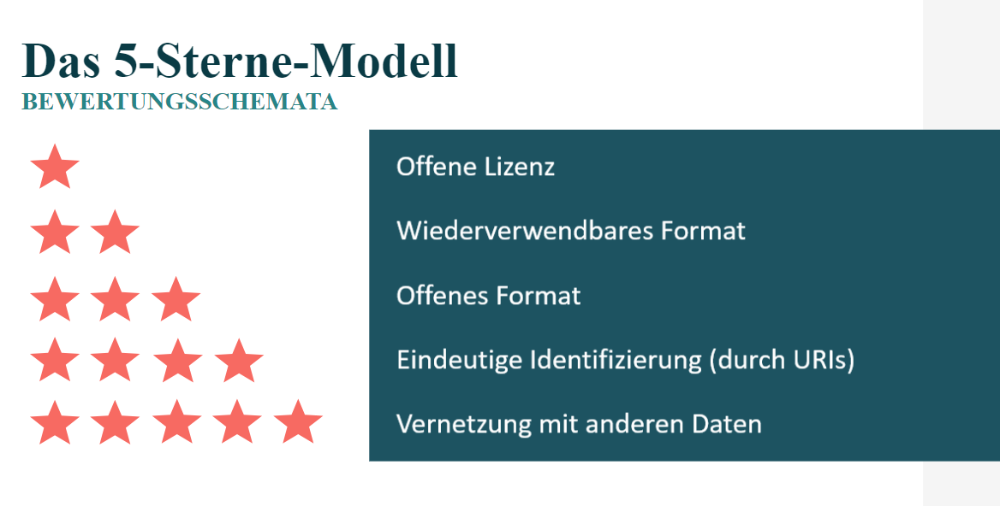

# 5-Sterne-Modell

In den vorherigen Abschnitten haben Sie bereits Merkmale zur Qualitätsbestimmung und mit den FAIR-Prinzipien auch ein Schema zur Bewertung kennengelernt. Bei dem nun folgenden <a href="https://5stardata.info/de" target="_blank">5-Sterne-Modell</a> steht ebenfalls die Wiederverwendbarkeit und Interoperabilität der Daten im Vordergrund {cite}`gangemi_assessing_2018`. Die fünf Stufen sind kaskadierend, d.h. damit ein Datensatz beispielsweise eine Bewertung von 3 Sternen erhalten kann, müssen die Stufen eins bis drei vollständig erfüllt sein {cite}`bruns_leitfaden_2019`. Das Modell wurde 2010 von Tim Burners-Lee als ein Weg zu Linked Data (s. Kapitel [Linked Data](linked_data)) entwickelt {cite}`berners-lee_linked_2006`. 

*Abbildung 3: Eigene Abbildung basierend auf {cite}`bruns_leitfaden_2019`.*

Mithilfe des 5-Sterne-Modells können folgende Einschätzungen hinsichtlich des Datensatzes vorgenommen werden:

- **1 Stern** = Der erste Stern wird an Datensätze verliehen, die unter einer offenen Lizenz zur Verfügung gestellt werden - unabhängig ihrer eigentlichen Datenqualität {cite}`bruns_leitfaden_2019`. Ein Stern bedeutet, dass der Nutzer auf die Daten zugreifen, sie nutzen, lokal speichern, bearbeiten und teilen kann {cite}`gangemi_assessing_2018`.

- **2 Sterne** = Ist der Datensatz mit zwei Sternen ausgezeichnet, handelt es sich um maschinenlesbare, strukturierte Daten (z. B. um eine Exceltabelle anstelle einer Fotokopie der Tabelle) (Al-khatib, 2021). Der Datensatz ist neben der offenen Lizenz zusätzlich leicht wiederverwendbar {cite}`bruns_leitfaden_2019`.

- **3 Sterne** = Der Datensatz erhält einen dritten Stern, wenn er in einem nicht-proprietären offenen Format zur Verfügung gestellt wird (Hasnain, 2018). Ein nicht-proprietäres Format bedeutet, dass der Datensatz unabhängig von einer spezifischen Software verwendet werden kann {cite}`bruns_leitfaden_2019`.

- **4 Sterne** = Die vierte Stufe erreicht ein Datensatz, sofern er eindeutig identifiziert wird, z.B. durch die Verwendung von PID (Persistent Identifier, s. Kapitel [PID](PID)). Nutzer können den Datensatz im Web oder lokal verlinken, Lesezeichen erstellen oder die Daten mit anderen Daten kombinieren {cite}`bruns_leitfaden_2019`. 

- **5 Sterne** = Ein Datensatz erreicht die letzte Stufe, wenn alle vorherigen Stufen erreicht wurden (kaskadierendes Modell). Der 5. Stern wird vergeben, wenn zusätzlich eine Verlinkung der Daten mit anderen Daten erfolgt. Diese Verlinkung ermöglicht es, den Datensatz in einen Kontext zu stellen und zwischen verschiedenen Datenpunkten zu navigieren. Nutzer können damit während der Nutzung ähnliche Daten entdecken und Informationen über das Datenschema erhalten {cite}`bruns_leitfaden_2019`.  
